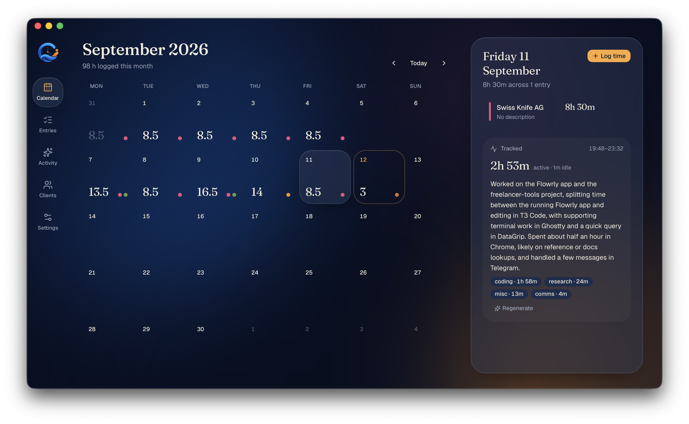
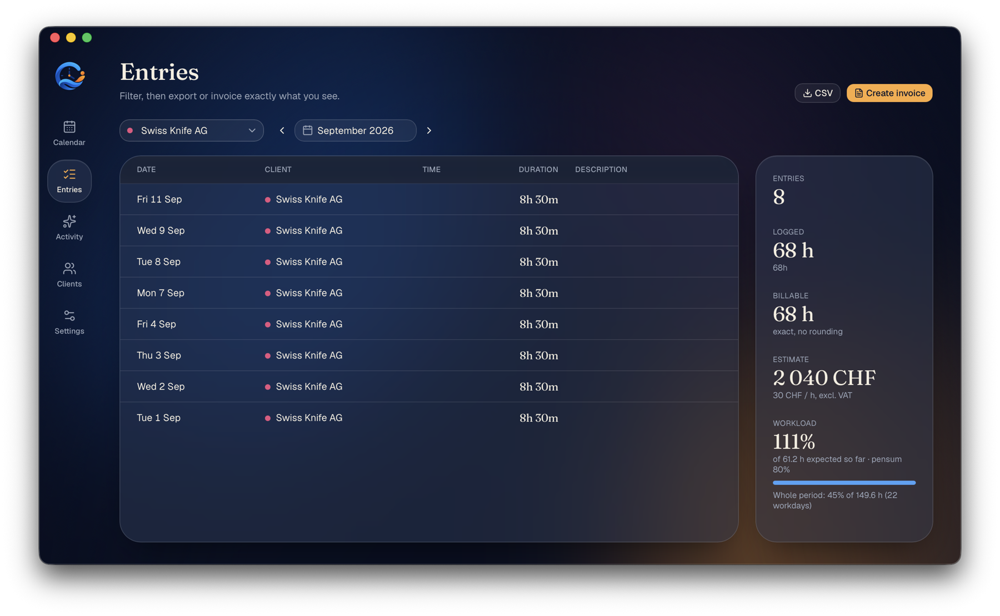
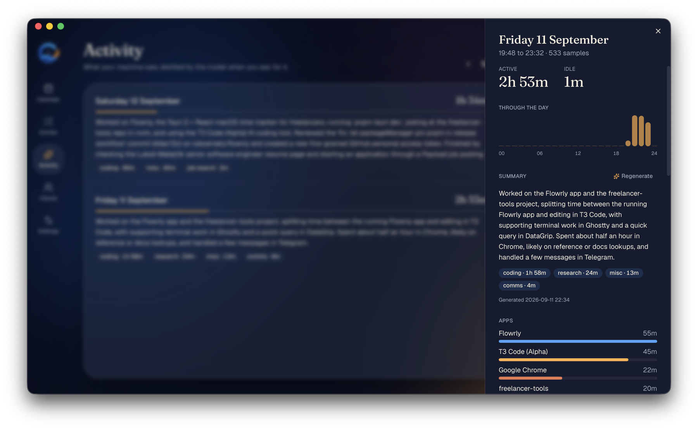
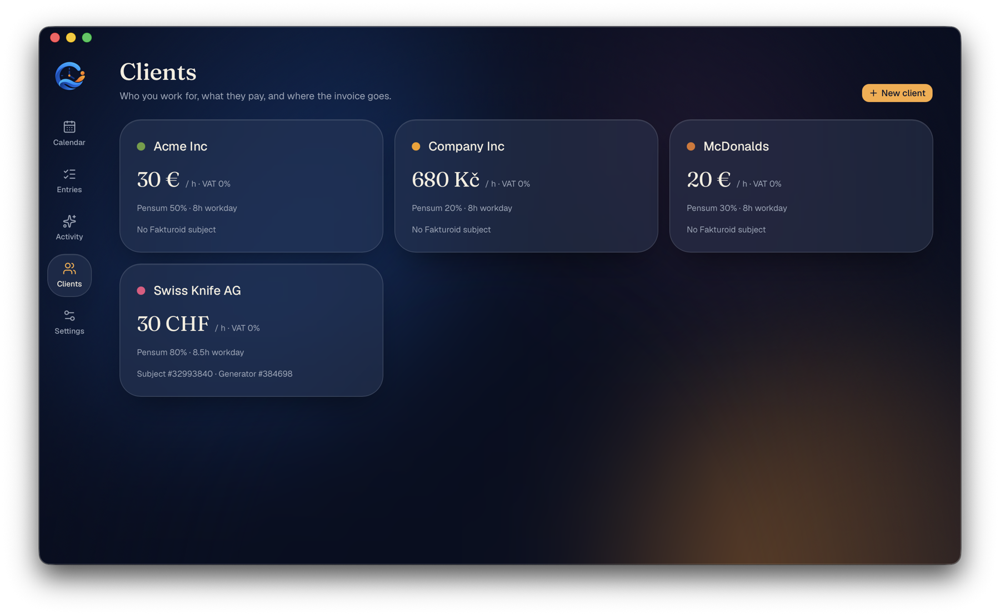

# Flowrly

Time flows. Freelance grows.

A small macOS menu-bar app for a freelancer: log hours per client, see them on a calendar, turn a filtered range into a Fakturoid invoice, export CSV, and let an LLM tell you what you actually did all day based on which windows had focus.

| Calendar | Entries |
| --- | --- |
|  |  |

| Activity | Clients |
| --- | --- |
|  |  |

## Install

Apple Silicon only.

```sh
brew trust lubosmato/tap
brew install --cask lubosmato/tap/flowrly
```

Needs Homebrew 6 or newer (run `brew update` if `brew trust` is unknown). Trust first: `brew tap` refuses casks from an untrusted tap and fails. `brew install` adds the tap itself.

The app is not notarized. The cask removes the quarantine flag after install so it launches without the Gatekeeper prompt. If you download the `.dmg` from [Releases](https://github.com/lubosmato/flowrly/releases) by hand instead, run `xattr -dr com.apple.quarantine /Applications/Flowrly.app` once.

## Release

Bump `version` in `src-tauri/tauri.conf.json`, `src-tauri/Cargo.toml` and `package.json`, then push a `v<version>` tag. The workflow builds the dmg, publishes a GitHub release and bumps the cask in [lubosmato/homebrew-tap](https://github.com/lubosmato/homebrew-tap).

## First run

1. `pnpm install`, then `pnpm tauri dev`.
2. **Clients**: add the company you bill, with hourly rate, VAT and the invoice line text (`{period}` becomes e.g. `09/2026`).
3. **Settings → Fakturoid**: paste the client ID and secret from Fakturoid → Settings → User account. Load and pick your account, then load subjects and generators in the client editor.
4. **Settings → AI**: pick a provider, keep the suggested model or change it, save the API key. Keys go to the macOS Keychain.
5. **Tracking**: macOS will ask for Accessibility permission the first time; without it the tracker sees app names but not window titles. The button in Settings opens the right pane.

Closing the window hides it to the menu bar; use the tray icon to bring it back or quit.

## How invoicing works

Filter entries on the **Entries** screen (one client, date range), press **Create invoice**. Total hours are exact (two decimals), one line at the client's rate. Invoice-level settings (currency, payment method, language, VAT mode, bank account, due days) are copied from the chosen Fakturoid generator. Fakturoid creates the invoice immediately, there is no draft. Flowrly keeps no record of what was invoiced; Fakturoid is the source of truth.

## Data

SQLite at `~/Library/Application Support/cz.lubosmatejcik.flowrly/flowrly.db`. A snapshot is written on launch and daily into `backups/` next to it (or a folder you choose), keeping the last 30. Restore from Settings; the app restarts.
